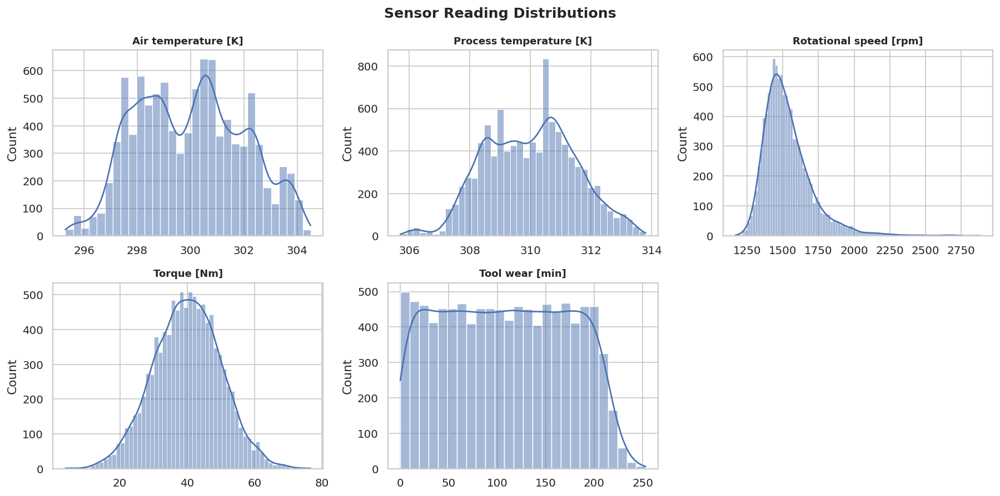
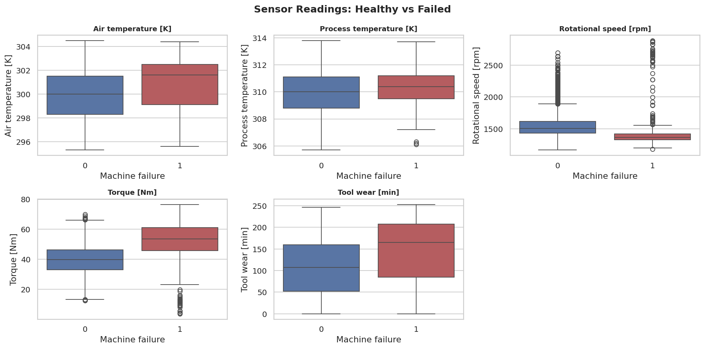
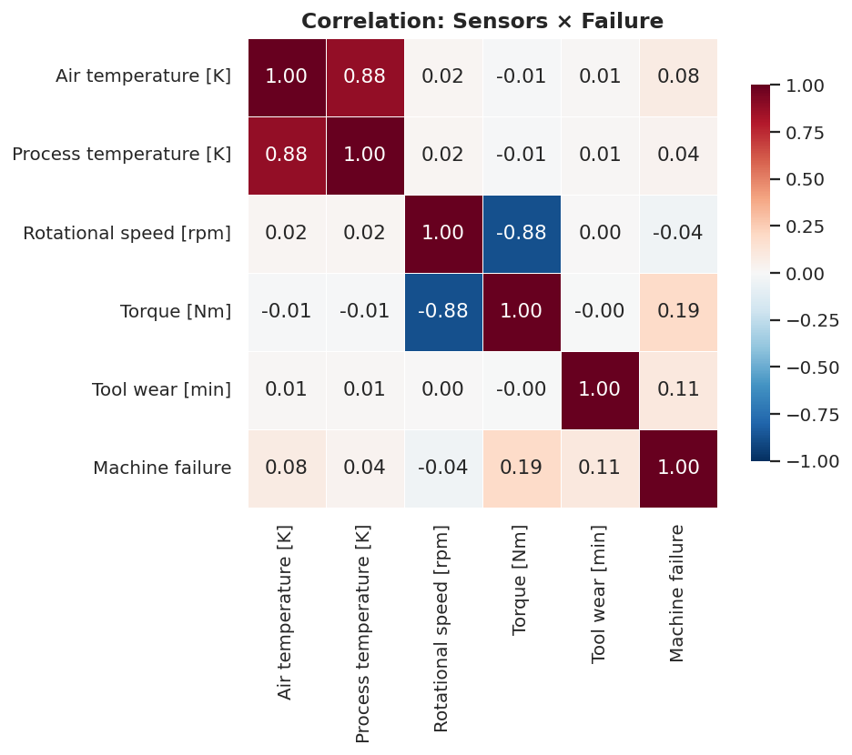
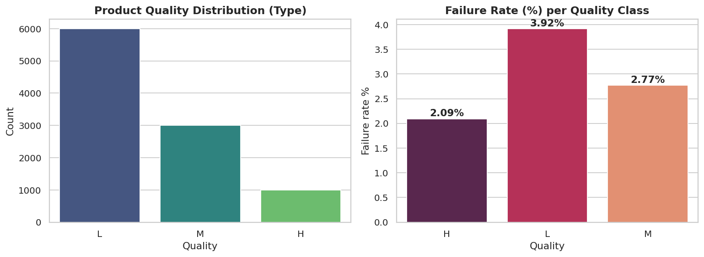
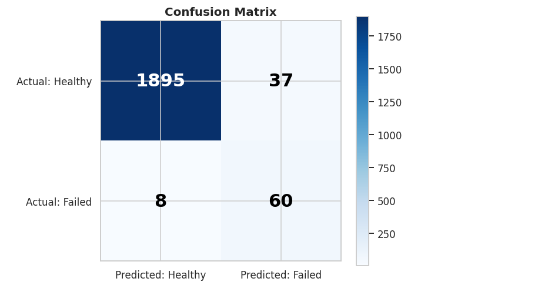
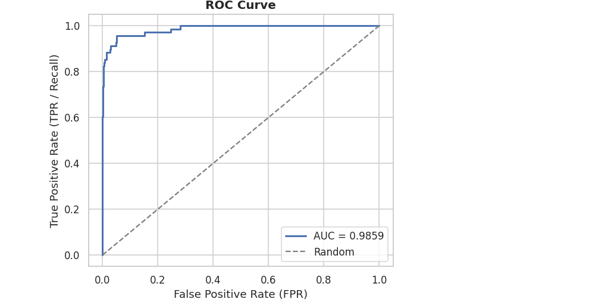
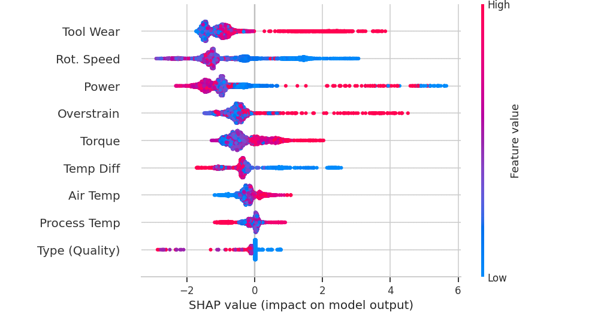

# 🏭 Industrial Predictive Maintenance & Fault Diagnostic Engine

[](https://python.org)
[](LICENSE)
[](https://scikit-learn.org)
[](https://xgboost.ai)

An end-to-end machine learning system that **predicts imminent industrial equipment failures before they happen** and **diagnoses their failure type**, based on live sensor readings — to prevent unplanned downtime and reduce maintenance costs.

---

## 🎯 Problem & Solution

| | |
|---|---|
| **Problem** | Unexpected equipment failures stop production lines and cost companies millions |
| **Solution** | A predictive model that determines *when*, *which machine*, and *what type of failure* — before it occurs |

## 🧩 Task Definition

- **Binary Classification** — Will the machine fail? (`Machine failure` = 0/1)
- **Multi-class Classification** — What failure type? (TWF / HDF / PWF / OSF / RNF + co-occurring failures)

## 📊 Dataset

The [AI4I 2020 Predictive Maintenance Dataset](https://archive.ics.uci.edu/dataset/601/ai4i+2020+predictive+maintenance+dataset) — 10,000 records of an industrial milling machine with 5 sensors:

| Sensor | Unit |
|--------|------|
| Air temperature | K |
| Process temperature | K |
| Rotational speed | rpm |
| Torque | Nm |
| Tool wear | min |

---

## 🛠️ Methodology (CRISP-DM)

```
[Problem Framing] → [EDA] → [Feature Engineering] → [Modeling & Tuning] → [SHAP Interpretation] → [Packaging]
```

## 🔬 Exploratory Data Analysis

### Sensor Distributions


### Healthy vs Failed


### Correlation Matrix


### Failure Rate by Product Quality


### Key Findings

1. **Documented internal inconsistency** in the original data between failure-type flags and the `Machine failure` column — reconciled with a clear policy.
2. **Severe class imbalance** (3.39% failures) — handled with `scale_pos_weight` + stratified cross-validation.
3. **Tool wear** is the leading driver of failures; product quality `Type` clearly affects failure rate.
4. **Physics-based feature engineering** derived from the known failure-generation rules: `Power`, `Temp Diff`, `Overstrain`.

---

## 🧪 Modeling

Three models compared fairly via 5-fold stratified cross-validation, then tuned with `GridSearchCV`:

| Model | Role |
|-------|------|
| Random Forest | Baseline |
| XGBoost | Advanced (best) |
| LightGBM | Advanced alternative |

**Chosen metric: Recall** — because missing a real failure is far more costly than a false alarm in predictive maintenance.

## 📈 Results (Tuned XGBoost)

| Metric | Value |
|--------|-------|
| **Recall (failure detection)** | **88.2%** |
| Precision | 61.9% |
| F1-Score | 72.7% |
| Accuracy | 97.75% |
| ROC-AUC | **98.6%** |

> 💡 **Recall was deliberately prioritized over Precision**: the cost of a missed failure (production downtime) vastly outweighs the cost of a false alarm (routine check).

### Confusion Matrix


### ROC Curve


### SHAP Feature Importance


SHAP confirms that **Tool Wear**, followed by **rotational speed drop** and **power/overstrain**, are the strongest signals the model captures — consistent with the real physics of the failures.

---

## ✨ Key Features

- ✅ Full **CRISP-DM** lifecycle (6 phases) in clean, documented Python.
- ✅ **Physics-based feature engineering** (Power, Temp Diff, Overstrain).
- ✅ **Imbalanced-data handling** (`scale_pos_weight`) + **stratified** validation.
- ✅ **Hyperparameter tuning** with `GridSearchCV`.
- ✅ **Model interpretability** with SHAP — engineer-friendly, not a black box.
- ✅ **Production-ready packaging**: modular `src/`, `config.py`, saved `.joblib` model.

## 🚀 Quick Start

```bash
git clone <repo-url>
cd predictive-maintenance-engine
pip install -r requirements.txt
python src/train.py       # train & save the model
python src/evaluate.py    # evaluate the saved model
```

## 📁 Repository Structure

```
predictive-maintenance-engine/
├── README.md
├── LICENSE
├── requirements.txt
├── config.py                    # central configuration
├── data/
│   └── ai4i2020.csv
├── assets/                      # analysis figures
├── notebooks/                   # five phase notebooks
├── models/                      # saved model (.joblib)
└── src/
    ├── data_loader.py
    ├── features.py
    ├── preprocessing.py
    ├── train.py
    └── evaluate.py
```

## 📄 License

MIT License — see [LICENSE](LICENSE).
